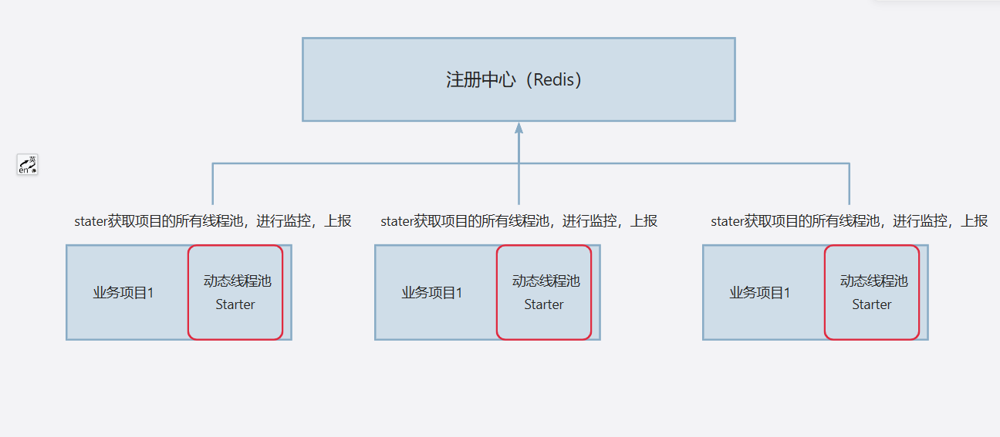
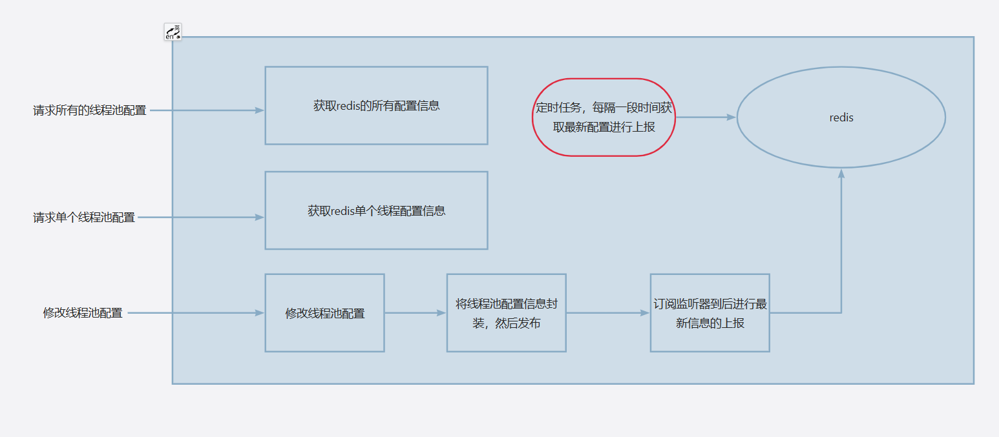

## 什么是动态线程池

简单来说，动态线程池就是能在不重新部署应用的情况下动态实时变更其核心参数，并 且能对其核心参数及运行状态进行监控及告警；以便开发人员可以及时感知到实际业务
中因为各种随机情况导致线程池异常的场景，并依据动态变更能力快速调整并验证参数 的合理性。

## 介绍

项目将核心逻辑封装，引入Starter将自动实现动态线程池的监控和调整。

- SpringBoot Starter 的设计和实现手段，以一个什么入口方式加载和启动组件。
- 线程池核心信息的获取，核心线程数、最大线程数、活跃线程数、队列类型、队列任务数、队列剩余可用任务数，通过这些信息的学习和开发，也会更多的了解线程池。
- 设计 Redis 版本的注册中心，通过 SDK 上报方式到 Redis 注册中心，做统一的管理，让各个接入动态线程池的组件都能统一管理。
- 掌握 Redis 的发布订阅能力，通过推送指定的主题，让对应的应用上的 sdk 监听和处置线程池。
- 定时任务 Scheduling 在组件中的启动和使用。组件项目与日常业务项目不同，不能全都是硬编码

## 设计

1. 使用流程
   
2. 业务流程
   
